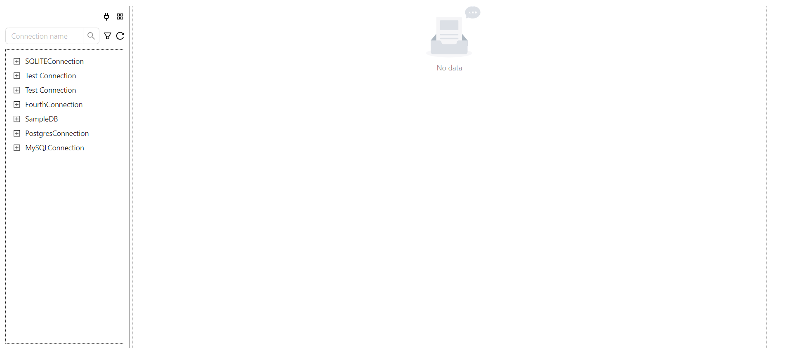
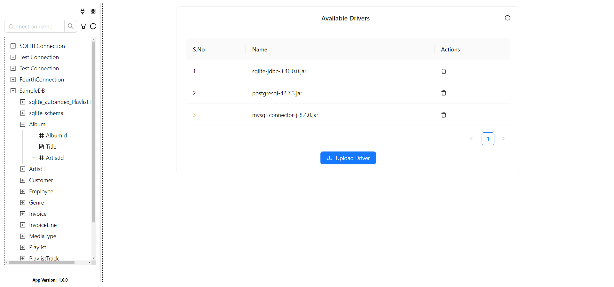
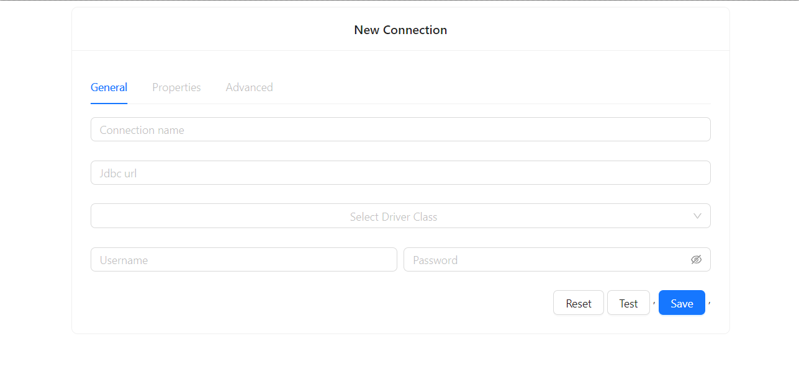
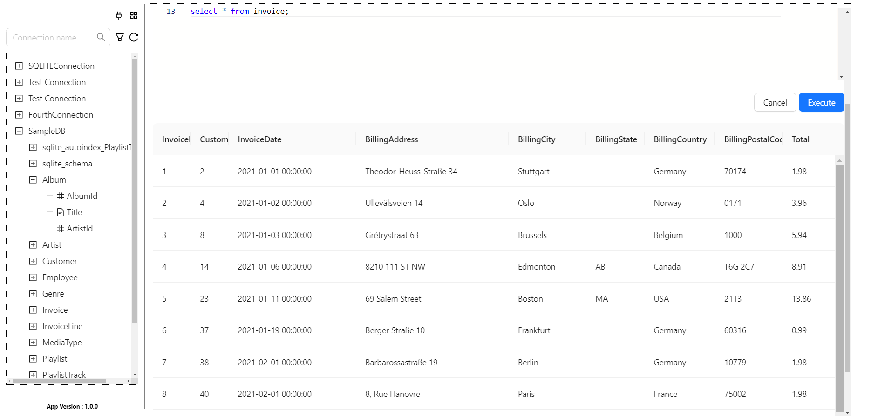
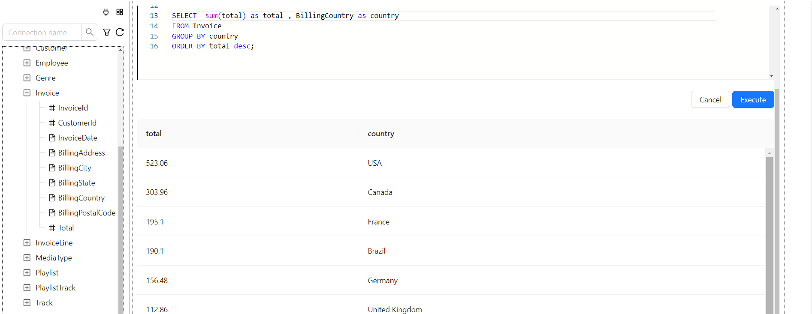

# SQL Client

## Overview

This project is a web-based SQL client built using Spring Boot and ReactJS. The application allows users to run SQL queries and fetch data from a SQLite database. It provides a user-friendly interface for managing and interacting with databases.

## Features

- Upload the JDBC drivers
- Execute SQL queries
- Fetch and display query results
- User-friendly interface
- SQLite database integration

## Technology Stack

### Backend
- Spring Boot

### Frontend
- ReactJS
- Ant Design (antd)

### Database
- SQLite

## Getting Started

### Prerequisites

- Java 21
- Node.js

### Installation

1. **Clone the repository:**
   ```sh
   git clone https://github.com/mahiimc/SQLClient.git
   cd sqlclient

2. **Build Backend**
    ```sh
    cd backend
    ./mvnw clean install
    ```
3. **Build UI**
    ```sh
    cd ui
    npm install
    npm run build
    ```
4. **Start Server**
    ```sh
    cd ../server
    ./mvnw spring-boot:run
    ```
5. **Start UI**
    ```sh
    cd ../ui
    npm start
    ```
## Sample UI


### Upload Driver



### Add Connection



### Query


